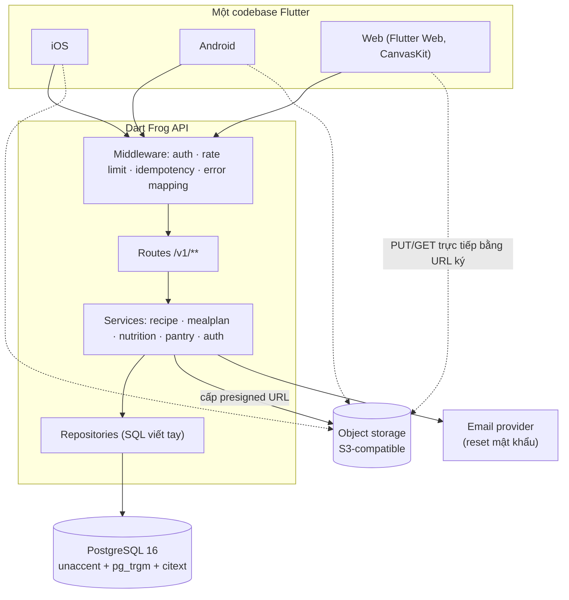
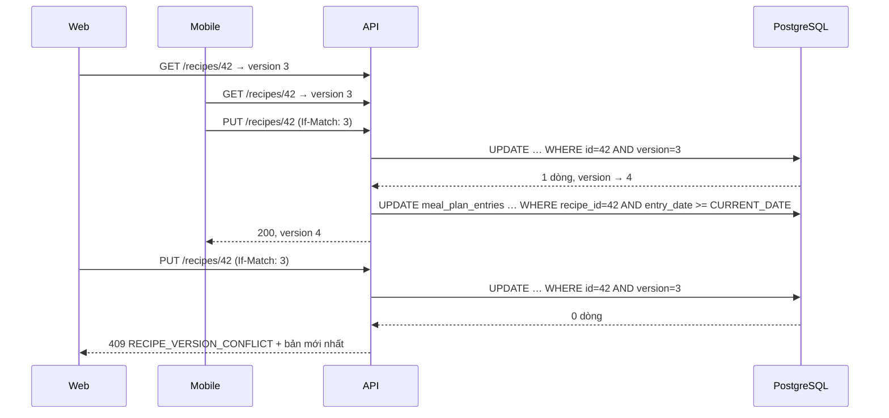

# Technical Design: Recipe & Meal Planning App — MVP

> Tài liệu này là *how*. *What* nằm ở [01-spec.md](./01-spec.md) — mọi BR-ID dưới đây **tham chiếu**, không chép lại.
> Schema chi tiết tách ra [03-database.md](./03-database.md). Wireframe từng màn hình tách ra [04-mock-ui.md](./04-mock-ui.md).

## 1. Tóm tắt giải pháp

Monorepo Dart quản lý bằng melos, chứa bốn package: một app Flutter chạy cho iOS/Android/Web, một API Dart
Frog, một package `shared` chứa model và luật validate dùng chung cho cả hai đầu, và một package `api_client`
sinh từ `shared` để app gọi API không phải tự viết lại DTO.

Dữ liệu nằm ở PostgreSQL. Dinh dưỡng được tính ở server và **ghi denormalized vào từng mục lịch ngay lúc
tạo**; sửa hoặc xoá công thức chỉ tính lại các mục có ngày từ hôm nay trở đi. Nhờ vậy mục lịch quá khứ tự
đóng băng mà không cần job nền nào (ADR-004).

Ảnh nằm ở object storage tương thích S3, upload và đọc đều qua URL ký ngắn hạn do API cấp — đây là cách duy
nhất thoả `BR-recipe-012` trên nền web mà không phải proxy toàn bộ byte ảnh qua API.

## 2. Kiến trúc tổng quan (System Context)

Thay đổi chạm 1 app đa nền tảng + 1 API + 3 hạ tầng ngoài (DB, object storage, email) nên phần này là bắt buộc.



**Lý do gom một API duy nhất thay vì tách service:** toàn bộ dữ liệu thuộc về một tài khoản và mọi truy vấn
đều nằm trong một transaction boundary; tách service ở giai đoạn này chỉ thêm chi phí mạng và mất ràng buộc
khoá ngoại. Đánh đổi chấp nhận: khi một lát cắt cần scale riêng thì phải tách sau.

**Lý do byte ảnh không đi qua API:** Flutter Web không có đường dẫn tệp và ảnh gốc từ iOS có thể 8–10 MB
(`NFR-platform-003`); đẩy byte qua API làm API thành nút thắt băng thông. Đánh đổi: phải quản lý vòng đời URL ký.

## 3. Thiết kế thành phần

### 3.1 Cấu trúc monorepo

```
recipe_and_meal_planning_app/
├── melos.yaml
├── planning/                      ← bộ tài liệu này
├── packages/
│   ├── shared/                    ← model + validation dùng chung client & server
│   │   └── lib/src/{model,validation,unit,error}/
│   └── api_client/                ← HTTP client có kiểu, sinh từ shared
├── apps/
│   ├── api/                       ← Dart Frog
│   │   ├── routes/v1/...
│   │   └── lib/src/{service,repository,middleware,security}/
│   └── app/                       ← Flutter iOS/Android/Web
│       └── lib/src/{core,features,routing}/
└── db/migrations/                 ← SQL thuần, đánh số tăng dần
```

**Lý do có package `shared`:** luật như "số khẩu phần là số nguyên 1–100" (`BR-recipe-004`) phải chạy ở cả hai
đầu — client để phản hồi tức thì, server vì client không đáng tin. Viết một lần ở `shared` là cách duy nhất
để hai đầu không trôi khỏi nhau. Đánh đổi: mọi thay đổi model buộc phải bump cả hai app cùng lúc.

### 3.2 Backend — Dart Frog, ba lớp

| Lớp | Trách nhiệm | Không được làm |
|-----|-------------|----------------|
| `routes/v1/**` | Parse request, gọi service, map kết quả sang HTTP | Không chứa logic nghiệp vụ, không chạm SQL |
| `lib/src/service/**` | Toàn bộ business rule, mở/đóng transaction | Không biết gì về `Request`/`Response` |
| `lib/src/repository/**` | SQL viết tay, map row sang model | Không chứa điều kiện nghiệp vụ |

**Lý do SQL viết tay thay vì ORM:** ba truy vấn nặng nhất của sản phẩm — tìm kiếm không dấu, tổng dinh dưỡng
một tuần, đối chiếu pantry — đều là truy vấn tập hợp mà ORM sinh ra kém và khó chỉnh. Đánh đổi: phải tự viết
mapping row sang model, bù lại bằng test repository chạy trên Postgres thật.

**Middleware, theo thứ tự chạy:**

1. `requestId` — gắn id cho log.
2. `errorMapper` — chuyển exception nghiệp vụ thành mã lỗi ổn định (mục 5).
3. `rateLimit` — chỉ áp cho `/auth/login` và `/auth/forgot-password` (`NFR-sec-002`).
4. `auth` — xác thực access token, nạp `userId` vào context; bỏ qua cho nhánh `/auth/**` công khai.
5. `idempotency` — với `POST` mang header `Idempotency-Key` (`NFR-sec-003`).

### 3.3 Frontend — Flutter một codebase, ba nền tảng

- **Quản lý trạng thái:** Riverpod. *Lý do:* trạng thái của sản phẩm chủ yếu là dữ liệu server không đồng bộ, và Riverpod diễn đạt loading/error/data thành kiểu dữ liệu nên không có màn hình nào quên xử lý lỗi — quan trọng vì sản phẩm là online-only. Đánh đổi: nhóm phải học khái niệm provider.
- **Điều hướng:** `go_router` với route khai báo bằng URL. *Lý do:* trên web, URL là API của trình duyệt — không có nó thì nút back, reload và chia sẻ link đều hỏng. Đánh đổi: điều hướng dài dòng hơn `Navigator.push`.
- **Responsive (`NFR-platform-002`):** ba dải bề rộng `< 600` / `600–1024` / `> 1024` dp, khai ở một chỗ duy nhất `core/layout/breakpoints.dart`. Điều hướng đổi theo dải: thanh dưới cho điện thoại, rail cho máy tính bảng, sidebar cố định cho desktop.
- **Renderer web:** CanvasKit. *Lý do:* lưới lịch tuần và danh sách công thức cuộn nhiều, HTML renderer cho chữ tiếng Việt và hiệu năng cuộn kém hơn rõ rệt. Đánh đổi: bundle đầu tiên nặng hơn khoảng 1,5 MB.
- **Chọn ảnh:** `image_picker` cho mobile (trả đường dẫn tệp) và `file_picker` trên web (trả bytes) sau một interface `ImageSource` duy nhất ở `core/media/`. *Lý do:* đây đúng là chỗ cần adapter vì có hai hiện thực thật, không phải một (`NFR-platform-003`).

### 3.4 Thiết kế giao diện (UI)

- **Design link:** (chưa có — chưa dựng Figma). Danh sách màn hình dưới đây **được suy ra từ spec**, chưa qua designer.
- **Design system:** Material 3, seed color tự chọn, hỗ trợ sáng/tối.
- **Wireframe chi tiết từng màn hình:** xem [04-mock-ui.md](./04-mock-ui.md).

| # | Màn hình | Mục đích |
|---|----------|----------|
| S-01 | Đăng nhập / Đăng ký | Vào tài khoản, tạo tài khoản mới |
| S-02 | Quên & đặt lại mật khẩu | Lấy lại quyền truy cập qua email |
| S-03 | Kế hoạch tuần | Màn hình chính: lưới 7 ngày × 4 bữa, tổng calo mỗi ngày so mục tiêu |
| S-04 | Chi tiết một ngày | Các món trong ngày theo bữa, chi tiết macro của ngày |
| S-05 | Danh sách công thức | Tìm kiếm, lọc theo tag, lọc "nấu được với đồ đang có" |
| S-06 | Chi tiết công thức | Nguyên liệu, các bước, dinh dưỡng mỗi khẩu phần, đối chiếu pantry, đổi khẩu phần |
| S-07 | Soạn công thức | Tạo/sửa, tự lưu nháp, công bố |
| S-08 | Chọn nguyên liệu | Tìm trong danh mục, tạo nguyên liệu riêng |
| S-09 | Pantry | Danh sách tồn theo lô, hạn dùng, thêm/sửa/xoá |
| S-10 | Thêm món vào lịch | Chọn công thức, ngày, bữa, số khẩu phần |
| S-11 | Sao chép tuần | Chọn tuần nguồn và tuần đích |
| S-12 | Hồ sơ & cài đặt | Mục tiêu calo, đổi mật khẩu, xoá tài khoản |

## 4. Quyết định kiến trúc (ADR)

### ADR-001 — Monorepo Dart bốn package, quản lý bằng melos
**Quyết định:** `shared`, `api_client`, `apps/api`, `apps/app` trong một repo.
**Lý do:** model và validation dùng chung ở cả hai đầu; tách repo là mời gọi hai bên trôi khỏi nhau ngay từ tuần đầu.
**Đánh đổi:** CI phải hiểu cấu trúc melos; một MR có thể chạm cả client lẫn server.
**Bị loại:** hai repo riêng — mỗi lần đổi model thành hai MR phải khớp nhau bằng tay.

### ADR-002 — Dart Frog + SQL viết tay, ba lớp, không ORM
**Quyết định:** route → service → repository, dùng package `postgres`, SQL viết tay.
**Lý do:** ba truy vấn nặng nhất đều là truy vấn tập hợp cần kiểm soát index và kế hoạch thực thi.
**Đánh đổi:** tự viết mapping và tự quản lý migration.
**Bị loại:** Serverpod — sinh client sẵn rất hấp dẫn, nhưng ràng buộc cách tổ chức code và làm ba truy vấn trên khó chỉnh.

### ADR-003 — Danh mục nguyên liệu hai tầng: hệ thống và riêng người dùng
**Quyết định:** một bảng `ingredients` với `owner_user_id` nullable; NULL nghĩa là nguyên liệu hệ thống dùng chung.
**Lý do:** thoả `BR-ingredient-001` và `BR-ingredient-002` mà không cần hai bảng và hai đường truy vấn.
**Đánh đổi:** mọi truy vấn nguyên liệu phải mang điều kiện `owner_user_id IS NULL OR owner_user_id = :me`; đóng gói trong repository để không lặp.
**Bị loại:** hai bảng riêng — mọi chỗ dùng nguyên liệu phải UNION, nhân đôi bề mặt lỗi.

### ADR-004 — Dinh dưỡng denormalized vào mục lịch, tính lại chỉ cho ngày từ hôm nay trở đi
**Quyết định:** `meal_plan_entries` luôn mang sẵn tên công thức và bốn chỉ số mỗi khẩu phần. Ghi lúc tạo mục lịch. Sửa hoặc xoá công thức chỉ đụng các mục có `entry_date >= CURRENT_DATE`.
**Lý do:** thoả `BR-recipe-021` và `BR-recipe-022` mà **không cần job nền nào** — mục quá khứ tự đóng băng vì không có đường nào ghi vào chúng. Cũng làm `BR-nutrition-006` thành một phép `SUM` một bảng thay vì join ba bảng mỗi lần xem lịch.
**Đánh đổi:** sửa một công thức đang nằm trong nhiều mục lịch tương lai sinh một lệnh UPDATE nhiều dòng; giới hạn 365 ngày của `BR-mealplan-007` giữ con số này hữu hạn.
**Bị loại:** tính on-the-fly khi đọc — vi phạm `BR-recipe-022` vì quá khứ sẽ đổi theo. Bị loại: job nền chạy đêm chốt sổ — thêm một thành phần có thể chết âm thầm và làm hỏng lịch sử đúng vào hôm nó chết.

### ADR-005 — Tìm kiếm không dấu bằng `unaccent` + `pg_trgm`, không dùng full-text search
**Quyết định:** cột sinh `search_text` chứa tên công thức, tên nguyên liệu và tag đã bỏ dấu và hạ chữ thường; index GIN trigram trên cột đó.
**Lý do:** `BR-search-002` yêu cầu khớp **chuỗi con** không dấu, việc mà `tsvector` không làm được vì nó khớp theo từ. Trigram khớp chuỗi con thật.
**Đánh đổi:** index trigram lớn hơn `tsvector` và không xếp hạng theo độ liên quan; ở quy mô 1.000 công thức mỗi tài khoản (`NFR-perf-001`) điều này không đáng kể.
**Bị loại:** lọc bằng `LIKE '%…%'` không index — quét toàn bảng, hỏng ngay khi kho lớn.

### ADR-006 — Ảnh qua object storage với URL ký ngắn hạn hai chiều
**Quyết định:** API cấp presigned PUT khi tải lên và presigned GET (sống 15 phút) khi đọc; byte không đi qua API.
**Lý do:** giữ được `BR-recipe-012` (chỉ chủ sở hữu xem được) mà không biến API thành nút thắt băng thông, và chạy được trên Flutter Web nơi không có đường dẫn tệp.
**Đánh đổi:** URL đã cấp vẫn dùng được tới khi hết hạn kể cả sau khi công thức bị xoá; 15 phút là cửa sổ được chấp nhận.
**Bị loại:** URL công khai khó đoán — vi phạm thẳng `BR-recipe-012`. Bị loại: proxy byte qua API — đơn giản hơn nhưng đẩy toàn bộ băng thông ảnh lên API.

### ADR-007 — Xoá mềm công thức, xoá cứng có trì hoãn cho tài khoản
**Quyết định:** `recipes.deleted_at`; tài khoản xoá thì đánh dấu và một tiến trình dọn chạy sau 30 ngày.
**Lý do:** `BR-recipe-021` cần tên công thức còn đọc được từ lịch sử sau khi xoá; `BR-auth-008` cần khôi phục trong 30 ngày.
**Đánh đổi:** mọi truy vấn công thức phải mang `deleted_at IS NULL`; ép vào repository và một partial index.

### ADR-008 — Kiểm soát ghi đè lạc quan bằng cột `version`
**Quyết định:** `recipes.version` tăng mỗi lần ghi; `UPDATE … WHERE id = :id AND version = :expected`, 0 dòng bị ảnh hưởng thì trả `409`.
**Lý do:** thoả `BR-recipe-017` bằng đúng một cột và một điều kiện `WHERE`, không cần khoá.
**Đánh đổi:** người dùng thua cuộc phải nhập lại; đây là quyết định có chủ ý thay cho việc mất thay đổi âm thầm.

### ADR-009 — Bảng `idempotency_keys` phục vụ mọi thao tác tạo
**Quyết định:** client sinh UUID cho mỗi hành động tạo; server lưu khoá kèm response đã trả và phát lại khi khoá lặp.
**Lý do:** `BR-recipe-018` và `NFR-sec-003`; mạng di động chập chờn khiến gửi lại là chuyện thường ngày, và đây là nguồn sinh bản ghi trùng lớn nhất.
**Đánh đổi:** một bảng phải dọn định kỳ (giữ 24 giờ).

### ADR-010 — Migration SQL thuần đánh số tăng dần, không dùng ORM migration
**Quyết định:** `db/migrations/NNNN_<tên>.sql`, chạy bằng một script Dart nhỏ đọc bảng `schema_migrations`.
**Lý do:** schema có extension, cột sinh và partial index — những thứ mà migration sinh tự động diễn đạt kém.
**Đánh đổi:** không có rollback tự động; mỗi migration phải viết kèm ghi chú hoàn tác.

## 5. Hợp đồng API

Tiền tố `/v1`. Mọi response lỗi dùng chung khuôn:

```json
{ "error": { "code": "RECIPE_VERSION_CONFLICT", "message": "…", "details": {} } }
```

| Mã lỗi | HTTP | BR liên quan |
|--------|------|--------------|
| `VALIDATION_FAILED` | 422 | BR-recipe-001 … BR-recipe-010 |
| `RECIPE_VERSION_CONFLICT` | 409 | BR-recipe-017 |
| `NOT_FOUND` | 404 | BR-auth-001 (không tiết lộ sự tồn tại) |
| `RATE_LIMITED` | 429 | BR-auth-005 |
| `TOKEN_EXPIRED` | 401 | BR-auth-006, BR-auth-007 |
| `EMAIL_TAKEN` | 409 | BR-auth-002 |
| `STORAGE_QUOTA_EXCEEDED` | 413 | NFR-data-002 |

### Auth
| Method | Path | Ghi chú |
|--------|------|---------|
| POST | `/auth/register` | Tạo tài khoản; seed công thức mẫu trong cùng transaction (`BR-auth-009`) |
| POST | `/auth/login` | Có rate limit (`BR-auth-005`) |
| POST | `/auth/refresh` | Xoay vòng refresh token (`BR-auth-006`) |
| POST | `/auth/logout` | Thu hồi refresh token hiện tại |
| POST | `/auth/forgot-password` | Luôn trả 204 dù email có tồn tại hay không |
| POST | `/auth/reset-password` | Token dùng một lần, sống 60 phút (`BR-auth-003`) |
| POST | `/auth/change-password` | Thu hồi mọi phiên khác (`BR-auth-004`) |
| DELETE | `/auth/account` | Xoá mềm, dọn sau 30 ngày (`BR-auth-008`) |

### Nguyên liệu
| Method | Path | Ghi chú |
|--------|------|---------|
| GET | `/ingredients?q=&limit=&cursor=` | Danh mục hệ thống hợp với nguyên liệu riêng của người dùng |
| POST | `/ingredients` | Tạo nguyên liệu riêng (`BR-ingredient-002`, `BR-ingredient-003`) |
| PATCH | `/ingredients/{id}` | Chỉ cho nguyên liệu riêng của chính người dùng |
| GET | `/units` | Tập đơn vị hệ thống hỗ trợ |

### Công thức
| Method | Path | Ghi chú |
|--------|------|---------|
| GET | `/recipes?q=&tags=&maxCookMinutes=&cookableNow=&limit=&cursor=` | `BR-search-001` … `BR-search-008` |
| POST | `/recipes` | Cần `Idempotency-Key` (`BR-recipe-018`) |
| GET | `/recipes/{id}?servings=` | `servings` khác cơ sở thì scale (`BR-nutrition-005`) |
| PUT | `/recipes/{id}` | Cần `If-Match: <version>` (`BR-recipe-017`) |
| POST | `/recipes/{id}/publish` | Nháp sang đã công bố, chạy validate đầy đủ (`BR-recipe-005`) |
| POST | `/recipes/{id}/duplicate` | `BR-recipe-016` |
| DELETE | `/recipes/{id}` | Xoá mềm, gỡ mục lịch từ hôm nay trở đi (`BR-recipe-019`, `BR-recipe-020`) |
| POST | `/recipes/{id}/image-upload-url` | Trả presigned PUT (ADR-006) |
| GET | `/recipes/{id}/pantry-check?servings=` | `BR-pantry-007` … `BR-pantry-009` |

### Kế hoạch bữa ăn
| Method | Path | Ghi chú |
|--------|------|---------|
| GET | `/meal-plan?from=&to=` | Khoảng ngày, kèm tổng dinh dưỡng mỗi ngày (`BR-nutrition-006`) |
| POST | `/meal-plan/entries` | Cần `Idempotency-Key`; `BR-mealplan-003` … `BR-mealplan-007` |
| PATCH | `/meal-plan/entries/{id}` | Chỉ đổi được số khẩu phần |
| DELETE | `/meal-plan/entries/{id}` | `BR-mealplan-009` |
| POST | `/meal-plan/copy-week` | `{ fromWeekStart, toWeekStart }` (`BR-mealplan-008`) |

### Pantry & hồ sơ
| Method | Path | Ghi chú |
|--------|------|---------|
| GET | `/pantry` | Danh sách lô, kèm cờ quá hạn (`BR-pantry-005`) |
| POST | `/pantry/items` | Gộp hoặc tách lô theo hạn dùng (`BR-pantry-002`, `BR-pantry-003`) |
| PATCH | `/pantry/items/{id}` | |
| DELETE | `/pantry/items/{id}` | |
| GET | `/me` | Hồ sơ, mục tiêu calo |
| PATCH | `/me` | Đặt mục tiêu calo (`BR-auth-010`) |

## 6. Luồng dữ liệu

### 6.1 Lưu công thức khi có tranh chấp phiên bản



### 6.2 Đối chiếu công thức với pantry (`BR-pantry-007`)

Với mỗi dòng nguyên liệu định lượng của công thức:

1. Quy lượng cần về đơn vị cơ sở của nguyên liệu, nhân theo tỉ lệ khẩu phần đang xét (`BR-pantry-009`).
   Không quy đổi được → kết luận **không xác định được**, dừng dòng này.
2. Cộng mọi lô pantry cùng nguyên liệu **còn hạn và số lượng lớn hơn 0**, quy về cùng đơn vị cơ sở
   (`BR-pantry-004` … `BR-pantry-006`). Một lô không quy đổi được → dòng này **không xác định được**.
3. So sánh: đủ, hoặc thiếu kèm lượng còn thiếu.

Công thức chỉ **đủ** khi mọi dòng đều đủ; chỉ một dòng "không xác định được" là cả công thức không đủ
(`BR-pantry-008`). Dòng gia giảm tuỳ khẩu vị bị bỏ qua hoàn toàn (`BR-recipe-007`).

## 7. Implementation map

| # | Tệp / vùng | Nội dung | BR / ADR |
|---|-----------|----------|----------|
| 1 | `db/migrations/0001_init.sql` … `0006_seed.sql` | Toàn bộ schema + seed danh mục và công thức mẫu | ADR-003, ADR-007, BR-auth-009 |
| 2 | `packages/shared/lib/src/unit/` | Tập đơn vị, quy đổi cùng hệ, quy đổi theo hệ số nguyên liệu | BR-ingredient-004, BR-ingredient-005 |
| 3 | `packages/shared/lib/src/validation/` | Validate công thức, mục lịch, mục pantry | BR-recipe-001…010, BR-mealplan-003 |
| 4 | `apps/api/lib/src/middleware/` | auth · rate limit · idempotency · error mapper | ADR-009, NFR-sec-002 |
| 5 | `apps/api/lib/src/service/auth_service.dart` | Đăng ký, đăng nhập, xoay token, reset, xoá tài khoản | BR-auth-001…009 |
| 6 | `apps/api/lib/src/service/recipe_service.dart` | CRUD, nháp/công bố, nhân bản, version, xoá mềm | BR-recipe-*, ADR-008 |
| 7 | `apps/api/lib/src/service/nutrition_service.dart` | Tính tổng công thức, mỗi khẩu phần, cờ ước tính chưa đầy đủ | BR-nutrition-001…005 |
| 8 | `apps/api/lib/src/service/meal_plan_service.dart` | Mục lịch, denormalize dinh dưỡng, copy tuần, tổng ngày | ADR-004, BR-mealplan-*, BR-nutrition-006…010 |
| 9 | `apps/api/lib/src/service/pantry_service.dart` | Lô tồn, gộp/tách theo hạn, đối chiếu công thức | BR-pantry-* |
| 10 | `apps/api/lib/src/repository/recipe_repository.dart` | Tìm kiếm trigram, phân trang cursor, lọc nấu được | ADR-005, BR-search-* |
| 11 | `apps/api/lib/src/service/image_service.dart` | Cấp presigned PUT/GET, kiểm tra hạn mức | ADR-006, NFR-data-002 |
| 12 | `apps/app/lib/src/core/` | Theme, breakpoint, HTTP client, refresh token, `ImageSource` | NFR-platform-002, NFR-platform-003 |
| 13 | `apps/app/lib/src/features/auth/` | S-01, S-02 | BR-auth-002…005 |
| 14 | `apps/app/lib/src/features/recipe/` | S-05, S-06, S-07, S-08 | BR-recipe-*, BR-search-* |
| 15 | `apps/app/lib/src/features/meal_plan/` | S-03, S-04, S-10, S-11 | BR-mealplan-* |
| 16 | `apps/app/lib/src/features/pantry/` | S-09 | BR-pantry-* |
| 17 | `apps/app/lib/src/features/profile/` | S-12 | BR-auth-008, BR-auth-010 |

Thứ tự dựng: 1 → 2 → 3 → 4 → 5 → (6, 7) → 8 → 9 → 10 → 11 → 12 → 13 → 14 → 15 → 16 → 17.

## 8. Chiến lược kiểm thử

- **Unit** — `packages/shared`: quy đổi đơn vị, validate, làm tròn `BR-nutrition-009`. Chạy không cần hạ tầng.
- **Unit** — service: tính dinh dưỡng và đối chiếu pantry với repository giả lập. Đây là nơi phần lớn BR được kiểm.
- **Integration** — repository chạy trên PostgreSQL thật trong container: tìm kiếm không dấu, phân trang cursor ổn định (`BR-search-007`), ghi đè lạc quan (`BR-recipe-017`), idempotency (`BR-recipe-018`).
- **Widget** — Flutter: mỗi màn hình render đúng ở cả ba dải bề rộng (`NFR-platform-002`).
- **E2E** — chưa có `.feature` nào; bước `to-bdd` của pipeline sẽ khoá hành vi thành Gherkin theo BR-ID rồi `gen-steps` sinh step definitions.

**Kiểm chứng tự động:**
```
melos run analyze          # dart analyze toàn monorepo
melos run test             # unit + widget
melos run test:integration # cần Docker cho PostgreSQL
```
**Kiểm chứng thủ công:** chạy app trên Chrome, một máy iOS và một máy Android; đối chiếu lưới tuần ở ba dải bề rộng; tải một ảnh HEIC từ iOS.

## 9. Rủi ro

| Rủi ro | Ảnh hưởng | Giảm thiểu |
|--------|-----------|-----------|
| Dữ liệu dinh dưỡng nguyên liệu Việt không có nguồn sạch | Cả nhóm dinh dưỡng mất giá trị | Chốt nguồn seed **trước** khi bắt đầu lát cắt dinh dưỡng; cờ "ước tính chưa đầy đủ" (`BR-nutrition-004`) giữ sản phẩm dùng được khi dữ liệu thủng |
| Bundle Flutter Web nặng làm lần tải đầu chậm | Bỏ trang trên web | Deferred loading theo route; đo trước khi tối ưu |
| Hệ số quy đổi theo nguyên liệu phủ thấp | Phần lớn công thức rơi vào "ước tính chưa đầy đủ" | Ưu tiên khai hệ số cho nhóm nguyên liệu đếm được hay gặp nhất khi seed |
| Denormalize dinh dưỡng vào mục lịch sinh UPDATE nhiều dòng | Sửa công thức bị chậm | Index `(recipe_id, entry_date)`; trần 365 ngày của `BR-mealplan-007` chặn số dòng |

## 10. Open Questions

| # | Câu hỏi | Loại | Chặn? | Owner |
|---|---------|------|-------|-------|
| TQ-01 | Chọn nhà cung cấp object storage và email nào? | Technical | ❌ | User — chốt trước lát cắt ảnh và lát cắt reset mật khẩu |
| TQ-02 | Nguồn dữ liệu dinh dưỡng để seed danh mục lấy ở đâu? | Data | ✅ cho lát cắt dinh dưỡng | User |
| TQ-03 | Triển khai ở đâu (VPS tự quản, Fly.io, Cloud Run)? | Technical | ❌ | User — chỉ ảnh hưởng khâu deploy |
| TQ-04 | Chưa có `.feature` nào cho 76 BR — chạy `to-bdd` trước khi code? | Process | ❌ | User |

> TQ-02 chặn **lát cắt dinh dưỡng**, không chặn lát cắt Auth, Công thức hay Kế hoạch bữa ăn; thứ tự dựng ở mục 7 đã xếp để ba lát đó chạy trước.
