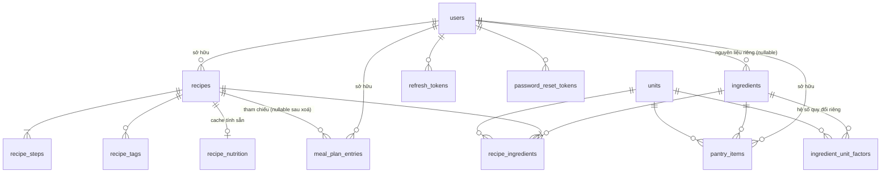

# Cơ sở dữ liệu — PostgreSQL 16

> ⚠️ **Đã được thay thế (2026-10-09).** Schema 12 bảng dưới đây là bản thiết kế cũ, không phải schema đang chạy.
> Schema chuẩn là `src/backend/migrations/sql/0001_init.sql` (Alembic), mô tả ở
> [05-implementation-plan.md](./05-implementation-plan.md) task BE-0.1.

> Phần này tách ra từ [02-tech-design.md](./02-tech-design.md). Quyết định kiến trúc liên quan: ADR-003
> (danh mục hai tầng), ADR-004 (denormalize dinh dưỡng), ADR-005 (tìm kiếm trigram), ADR-007 (xoá mềm),
> ADR-008 (cột `version`), ADR-010 (migration SQL thuần).

## 1. Extension

```sql
CREATE EXTENSION IF NOT EXISTS "uuid-ossp";
CREATE EXTENSION IF NOT EXISTS citext;    -- email không phân biệt hoa thường (BR-auth-002)
CREATE EXTENSION IF NOT EXISTS unaccent;  -- bỏ dấu tiếng Việt (BR-search-002)
CREATE EXTENSION IF NOT EXISTS pg_trgm;   -- index khớp chuỗi con (ADR-005)
```

`unaccent` mặc định không phải `IMMUTABLE` nên không dùng trực tiếp trong index được. Bọc lại một lần:

```sql
CREATE OR REPLACE FUNCTION immutable_unaccent(text)
RETURNS text LANGUAGE sql IMMUTABLE PARALLEL SAFE STRICT AS
$$ SELECT lower(public.unaccent('public.unaccent', $1)) $$;
```

*Lý do:* không có hàm `IMMUTABLE` thì không tạo được index biểu thức, và không có index thì `BR-search-002`
phải quét toàn bảng. Đánh đổi: nếu từ điển `unaccent` đổi thì phải reindex thủ công.

## 2. Sơ đồ quan hệ



## 3. Kiểu liệt kê

```sql
CREATE TYPE recipe_status   AS ENUM ('draft', 'published');
CREATE TYPE meal_slot       AS ENUM ('breakfast', 'lunch', 'dinner', 'snack');
CREATE TYPE unit_dimension  AS ENUM ('mass', 'volume', 'count');
```

`meal_slot` là enum chứ không phải bảng vì `BR-mealplan-002` nói rõ tập bữa là cố định và người dùng không
tự tạo được. Đánh đổi: thêm một bữa mới cần migration, đúng với ý đồ của rule.

## 4. Bảng

### 4.1 `users`

```sql
CREATE TABLE users (
  id                  uuid PRIMARY KEY DEFAULT uuid_generate_v4(),
  email               citext NOT NULL,
  password_hash       text   NOT NULL,
  daily_calorie_goal  integer,
  image_bytes_used    bigint NOT NULL DEFAULT 0,
  created_at          timestamptz NOT NULL DEFAULT now(),
  deleted_at          timestamptz,
  purge_after         timestamptz,
  CONSTRAINT users_goal_positive CHECK (daily_calorie_goal IS NULL OR daily_calorie_goal > 0)
);

-- BR-auth-002: chỉ ràng buộc duy nhất trên tài khoản ĐANG tồn tại,
-- để email dùng lại được sau khi tài khoản bị xoá hẳn.
CREATE UNIQUE INDEX users_email_active_uq ON users (email) WHERE deleted_at IS NULL;
CREATE INDEX users_purge_idx ON users (purge_after) WHERE purge_after IS NOT NULL;
```

| Cột | Ghi chú |
|-----|---------|
| `email` | `citext` nên so sánh không phân biệt hoa thường mà không cần chuẩn hoá ở tầng ứng dụng (`BR-auth-002`) |
| `daily_calorie_goal` | `NULL` nghĩa là chưa đặt mục tiêu; ràng buộc dương thoả `BR-auth-010` |
| `image_bytes_used` | Trần lưu trữ ảnh mỗi tài khoản (`NFR-data-002`) |
| `deleted_at` / `purge_after` | `BR-auth-008`: khoá truy cập ngay, dọn hẳn sau 30 ngày |

### 4.2 `refresh_tokens`, `password_reset_tokens`, `login_attempts`

```sql
CREATE TABLE refresh_tokens (
  id          uuid PRIMARY KEY DEFAULT uuid_generate_v4(),
  user_id     uuid NOT NULL REFERENCES users(id) ON DELETE CASCADE,
  token_hash  text NOT NULL UNIQUE,
  expires_at  timestamptz NOT NULL,
  revoked_at  timestamptz,
  created_at  timestamptz NOT NULL DEFAULT now()
);
CREATE INDEX refresh_tokens_user_idx ON refresh_tokens (user_id) WHERE revoked_at IS NULL;

CREATE TABLE password_reset_tokens (
  id          uuid PRIMARY KEY DEFAULT uuid_generate_v4(),
  user_id     uuid NOT NULL REFERENCES users(id) ON DELETE CASCADE,
  token_hash  text NOT NULL UNIQUE,
  expires_at  timestamptz NOT NULL,
  used_at     timestamptz
);

CREATE TABLE login_attempts (
  email        citext NOT NULL,
  attempted_at timestamptz NOT NULL DEFAULT now(),
  succeeded    boolean NOT NULL
);
CREATE INDEX login_attempts_email_time_idx ON login_attempts (email, attempted_at DESC);
```

Lưu **băm** của token chứ không lưu token: rò database không đồng nghĩa với chiếm được phiên.
`BR-auth-004` (đổi mật khẩu thu hồi mọi phiên khác) thực hiện bằng `UPDATE refresh_tokens SET revoked_at = now()
WHERE user_id = :me AND id <> :current`. `BR-auth-005` đếm trong `login_attempts` 15 phút gần nhất.

### 4.3 `units` — tập đơn vị hệ thống

```sql
CREATE TABLE units (
  code           text PRIMARY KEY,
  label_vi       text NOT NULL,
  dimension      unit_dimension NOT NULL,
  -- Chỉ đơn vị mass/volume mới có hệ số cố định toàn hệ thống (BR-ingredient-005).
  -- Đơn vị 'count' để NULL vì hệ số là RIÊNG của từng nguyên liệu (BR-ingredient-004).
  factor_to_base numeric(12,4),
  CONSTRAINT units_factor_rule CHECK (
    (dimension IN ('mass','volume') AND factor_to_base IS NOT NULL)
    OR (dimension = 'count' AND factor_to_base IS NULL)
  )
);

INSERT INTO units (code, label_vi, dimension, factor_to_base) VALUES
  ('g',     'gam',          'mass',   1),
  ('kg',    'kilogam',      'mass',   1000),
  ('ml',    'mililit',      'volume', 1),
  ('l',     'lít',          'volume', 1000),
  ('tsp',   'thìa cà phê',  'count',  NULL),
  ('tbsp',  'thìa canh',    'count',  NULL),
  ('cup',   'cup',          'count',  NULL),
  ('piece', 'quả/cái',      'count',  NULL),
  ('slice', 'lát',          'count',  NULL),
  ('bunch', 'nhánh/bó',     'count',  NULL);
```

Ràng buộc `units_factor_rule` là chỗ `BR-ingredient-004` và `BR-ingredient-005` gặp nhau: database từ chối
một đơn vị đếm mang hệ số toàn hệ thống, nên không ai vô tình quy đổi "1 quả" thành gam cho mọi nguyên liệu.

### 4.4 `ingredients` — danh mục hai tầng (ADR-003)

```sql
CREATE TABLE ingredients (
  id             uuid PRIMARY KEY DEFAULT uuid_generate_v4(),
  owner_user_id  uuid REFERENCES users(id) ON DELETE CASCADE,  -- NULL = nguyên liệu hệ thống
  name           text NOT NULL,
  name_norm      text GENERATED ALWAYS AS (immutable_unaccent(name)) STORED,
  base_unit      text NOT NULL REFERENCES units(code),
  kcal_per_100   numeric(7,2),
  protein_per_100 numeric(7,2),
  carb_per_100    numeric(7,2),
  fat_per_100     numeric(7,2),
  created_at     timestamptz NOT NULL DEFAULT now(),

  -- BR-ingredient-001: đơn vị cơ sở chỉ được là gam hoặc mililit
  CONSTRAINT ing_base_unit CHECK (base_unit IN ('g','ml')),
  -- BR-ingredient-003: không âm, calo không quá 900 trên 100 đơn vị cơ sở
  CONSTRAINT ing_kcal_range CHECK (kcal_per_100 IS NULL OR (kcal_per_100 >= 0 AND kcal_per_100 <= 900)),
  CONSTRAINT ing_macro_nonneg CHECK (
    coalesce(protein_per_100, 0) >= 0 AND coalesce(carb_per_100, 0) >= 0 AND coalesce(fat_per_100, 0) >= 0
  ),
  -- Dữ liệu dinh dưỡng có thì phải có đủ bốn chỉ số, không có thì để trống cả bốn (BR-nutrition-001)
  CONSTRAINT ing_nutrition_all_or_none CHECK (
    num_nulls(kcal_per_100, protein_per_100, carb_per_100, fat_per_100) IN (0, 4)
  )
);

CREATE UNIQUE INDEX ing_name_system_uq ON ingredients (name_norm) WHERE owner_user_id IS NULL;
CREATE UNIQUE INDEX ing_name_user_uq   ON ingredients (owner_user_id, name_norm) WHERE owner_user_id IS NOT NULL;
CREATE INDEX ing_name_trgm_idx ON ingredients USING gin (name_norm gin_trgm_ops);
CREATE INDEX ing_owner_idx ON ingredients (owner_user_id) WHERE owner_user_id IS NOT NULL;
```

Ràng buộc `ing_nutrition_all_or_none` là cách database diễn đạt `BR-nutrition-004`: một nguyên liệu hoặc có
đủ dữ liệu, hoặc không có gì — không tồn tại trạng thái nửa vời khiến tổng dinh dưỡng vừa sai vừa không
được đánh dấu là ước tính.

### 4.5 `ingredient_unit_factors` — hệ số quy đổi riêng (BR-ingredient-004)

```sql
CREATE TABLE ingredient_unit_factors (
  ingredient_id  uuid NOT NULL REFERENCES ingredients(id) ON DELETE CASCADE,
  unit_code      text NOT NULL REFERENCES units(code),
  base_amount    numeric(12,4) NOT NULL,  -- 1 <unit_code> = base_amount <base_unit của nguyên liệu>
  PRIMARY KEY (ingredient_id, unit_code),
  CONSTRAINT iuf_positive CHECK (base_amount > 0)
);
```

Ví dụ: `('Trứng gà', 'piece', 55)` nghĩa là 1 quả trứng gà bằng 55 gam. Thiếu dòng này thì dòng nguyên liệu
dùng đơn vị đó không quy đổi được và công thức mang cờ ước tính chưa đầy đủ (`BR-nutrition-003`).

### 4.6 `recipes`

```sql
CREATE TABLE recipes (
  id            uuid PRIMARY KEY DEFAULT uuid_generate_v4(),
  user_id       uuid NOT NULL REFERENCES users(id) ON DELETE CASCADE,
  name          text NOT NULL,
  status        recipe_status NOT NULL DEFAULT 'draft',
  servings      integer,
  cook_minutes  integer,
  image_key     text,
  version       integer NOT NULL DEFAULT 1,
  search_text   text NOT NULL DEFAULT '',   -- tên + tên nguyên liệu + tag, đã bỏ dấu (ADR-005)
  created_at    timestamptz NOT NULL DEFAULT now(),
  updated_at    timestamptz NOT NULL DEFAULT now(),
  deleted_at    timestamptz,

  -- BR-recipe-001 / BR-recipe-004: chỉ ràng buộc khi ĐÃ CÔNG BỐ.
  -- Nháp chỉ cần tên (BR-recipe-005), nên mọi ràng buộc đầy đủ đều có mệnh đề status.
  CONSTRAINT rec_name_len CHECK (char_length(btrim(name)) BETWEEN 1 AND 120),
  CONSTRAINT rec_servings_published CHECK (
    status = 'draft' OR (servings IS NOT NULL AND servings BETWEEN 1 AND 100)
  ),
  CONSTRAINT rec_cook_minutes CHECK (cook_minutes IS NULL OR cook_minutes > 0)
);

CREATE INDEX rec_search_trgm_idx ON recipes USING gin (search_text gin_trgm_ops)
  WHERE deleted_at IS NULL AND status = 'published';
CREATE INDEX rec_list_idx ON recipes (user_id, created_at DESC, id)
  WHERE deleted_at IS NULL AND status = 'published';
CREATE INDEX rec_draft_idx ON recipes (user_id, updated_at DESC) WHERE deleted_at IS NULL AND status = 'draft';
```

**`search_text` không phải cột sinh** vì nó lấy dữ liệu từ ba bảng con, mà cột sinh của PostgreSQL chỉ đọc
được cùng một dòng. Nó được `recipe_service` tính lại **trong cùng transaction** với mọi lần ghi công thức.
*Lý do chọn cách này thay vì trigger:* công thức luôn được ghi trọn cụm qua đúng một service, nên không có
đường ghi nào đi vòng; một trigger trên ba bảng con sẽ chạy thừa nhiều lần cho một lần lưu.
*Đánh đổi:* nếu sau này có đường ghi thứ hai vào `recipe_ingredients` thì phải nhớ cập nhật `search_text`.

**Ràng buộc "phải có ít nhất một nguyên liệu và một bước nấu"** (`BR-recipe-002`, `BR-recipe-003`) không diễn
đạt được bằng `CHECK` vì nó nói về bảng con. Nó được kiểm trong `recipe_service` tại thời điểm công bố, và
được phủ bằng integration test trên Postgres thật.

### 4.7 `recipe_ingredients`, `recipe_steps`, `recipe_tags`

```sql
CREATE TABLE recipe_ingredients (
  id             uuid PRIMARY KEY DEFAULT uuid_generate_v4(),
  recipe_id      uuid NOT NULL REFERENCES recipes(id) ON DELETE CASCADE,
  position       integer NOT NULL,
  ingredient_id  uuid NOT NULL REFERENCES ingredients(id) ON DELETE RESTRICT,
  quantity       numeric(12,4),
  unit_code      text REFERENCES units(code),
  is_to_taste    boolean NOT NULL DEFAULT false,
  note           text,

  -- BR-recipe-007: gia giảm tuỳ khẩu vị thì không được kèm định lượng, và ngược lại
  CONSTRAINT ri_quantity_rule CHECK (
    (is_to_taste AND quantity IS NULL AND unit_code IS NULL)
    OR (NOT is_to_taste AND quantity IS NOT NULL AND unit_code IS NOT NULL)
  ),
  -- BR-recipe-006: số lượng lớn hơn 0 và không quá 100.000
  CONSTRAINT ri_quantity_range CHECK (quantity IS NULL OR (quantity > 0 AND quantity <= 100000))
);

-- BR-recipe-009: cùng nguyên liệu VÀ cùng đơn vị là trùng; khác đơn vị thì hợp lệ
CREATE UNIQUE INDEX ri_no_dup_idx ON recipe_ingredients (recipe_id, ingredient_id, unit_code)
  WHERE NOT is_to_taste;
CREATE UNIQUE INDEX ri_position_uq ON recipe_ingredients (recipe_id, position);
CREATE INDEX ri_ingredient_idx ON recipe_ingredients (ingredient_id);

CREATE TABLE recipe_steps (
  recipe_id    uuid NOT NULL REFERENCES recipes(id) ON DELETE CASCADE,
  step_no      integer NOT NULL,
  instruction  text NOT NULL,
  PRIMARY KEY (recipe_id, step_no),
  -- BR-recipe-010: đánh số bắt đầu từ 1
  CONSTRAINT rs_step_no_positive CHECK (step_no >= 1),
  CONSTRAINT rs_instruction_nonempty CHECK (char_length(btrim(instruction)) > 0)
);

CREATE TABLE recipe_tags (
  recipe_id  uuid NOT NULL REFERENCES recipes(id) ON DELETE CASCADE,
  tag        text NOT NULL,       -- đã chuẩn hoá: cắt + gộp khoảng trắng, hạ chữ thường
  PRIMARY KEY (recipe_id, tag)    -- BR-recipe-013: trùng sau chuẩn hoá chỉ tính một lần
);
CREATE INDEX rt_tag_idx ON recipe_tags (tag);
```

Khoá chính `(recipe_id, tag)` là chỗ `BR-recipe-013` được database bảo đảm — miễn service chuẩn hoá tag trước
khi ghi, chèn trùng là lỗi khoá chính chứ không phải một tag thứ hai. Trần 20 tag (`BR-recipe-014`) kiểm ở
service vì nó là ràng buộc trên số dòng.

Bước nấu "liên tiếp, không đứt quãng" (`BR-recipe-010`) được service bảo đảm bằng cách **ghi lại toàn bộ tập
bước** mỗi lần lưu, đánh số lại từ 1; khoá chính chỉ chặn trùng số.

### 4.8 `recipe_nutrition` — cache tính sẵn

```sql
CREATE TABLE recipe_nutrition (
  recipe_id        uuid PRIMARY KEY REFERENCES recipes(id) ON DELETE CASCADE,
  kcal_total       numeric(12,4) NOT NULL,
  protein_total    numeric(12,4) NOT NULL,
  carb_total       numeric(12,4) NOT NULL,
  fat_total        numeric(12,4) NOT NULL,
  is_estimate      boolean NOT NULL,         -- BR-nutrition-003, BR-nutrition-004
  missing_ing_ids  uuid[] NOT NULL DEFAULT '{}',
  computed_at      timestamptz NOT NULL DEFAULT now()
);
```

Lưu **tổng chưa làm tròn** với 4 chữ số thập phân; chia cho số khẩu phần và làm tròn chỉ xảy ra lúc trình bày
(`BR-nutrition-009`). `missing_ing_ids` là danh sách nguyên liệu không tính được, để trả về kèm cờ ước tính
chưa đầy đủ chứ không bắt client tự suy ra.

### 4.9 `meal_plan_entries` — nơi ADR-004 sống

```sql
CREATE TABLE meal_plan_entries (
  id            uuid PRIMARY KEY DEFAULT uuid_generate_v4(),
  user_id       uuid NOT NULL REFERENCES users(id) ON DELETE CASCADE,
  entry_date    date NOT NULL,                 -- ngày lịch THUẦN, không giờ, không múi giờ (BR-mealplan-001)
  slot          meal_slot NOT NULL,
  recipe_id     uuid REFERENCES recipes(id) ON DELETE SET NULL,
  servings      numeric(5,1) NOT NULL,

  -- Snapshot ghi lúc tạo; chỉ cập nhật cho entry_date >= CURRENT_DATE (ADR-004)
  recipe_name   text NOT NULL,
  kcal_per_serv numeric(12,4) NOT NULL,
  prot_per_serv numeric(12,4) NOT NULL,
  carb_per_serv numeric(12,4) NOT NULL,
  fat_per_serv  numeric(12,4) NOT NULL,
  is_estimate   boolean NOT NULL,

  created_at    timestamptz NOT NULL DEFAULT now(),

  -- BR-mealplan-003: số khẩu phần lớn hơn 0, không quá 50, bước 0,5
  CONSTRAINT mpe_servings_range CHECK (servings > 0 AND servings <= 50),
  CONSTRAINT mpe_servings_step  CHECK ((servings * 2) = floor(servings * 2))
);

CREATE INDEX mpe_user_date_idx   ON meal_plan_entries (user_id, entry_date, slot);
CREATE INDEX mpe_recipe_future_idx ON meal_plan_entries (recipe_id, entry_date);
```

**Không có ràng buộc duy nhất trên `(user_id, entry_date, slot, recipe_id)`** — đó là cố ý: `BR-mealplan-005`
cho phép cùng một công thức xuất hiện nhiều lần trong một bữa (ăn thêm bát thứ hai), mỗi lần là một mục riêng.

`recipe_id` để `ON DELETE SET NULL` chứ không `CASCADE`: khi tài khoản bị xoá hẳn sau 30 ngày thì công thức
biến mất nhưng mục lịch quá khứ vẫn còn tên và số liệu trong chính dòng của nó (`BR-recipe-021`). Xoá mềm
thông thường không đụng tới `recipe_id`.

Hai giới hạn thời gian (`BR-mealplan-006` quá khứ 30 ngày, `BR-mealplan-007` tương lai 365 ngày) **không**
đặt thành `CHECK` vì chúng phụ thuộc ngày hiện tại, mà `CHECK` phải `IMMUTABLE`. Chúng được kiểm ở service.

### 4.10 `pantry_items`

```sql
CREATE TABLE pantry_items (
  id             uuid PRIMARY KEY DEFAULT uuid_generate_v4(),
  user_id        uuid NOT NULL REFERENCES users(id) ON DELETE CASCADE,
  ingredient_id  uuid NOT NULL REFERENCES ingredients(id) ON DELETE RESTRICT,
  quantity       numeric(12,4) NOT NULL,
  unit_code      text NOT NULL REFERENCES units(code),
  expires_on     date,
  updated_at     timestamptz NOT NULL DEFAULT now(),

  CONSTRAINT pi_quantity_nonneg CHECK (quantity >= 0)   -- BR-pantry-001
);

-- BR-pantry-002 / BR-pantry-003: trùng cả ba thì gộp, khác hạn dùng thì tách lô.
-- NULLS NOT DISTINCT để hai lô cùng "không khai hạn" cũng được coi là trùng nhau.
CREATE UNIQUE INDEX pi_lot_uq
  ON pantry_items (user_id, ingredient_id, unit_code, expires_on) NULLS NOT DISTINCT;
CREATE INDEX pi_user_ing_idx ON pantry_items (user_id, ingredient_id);
```

`NULLS NOT DISTINCT` (PostgreSQL 15 trở lên) là chi tiết quyết định ở đây: mặc định PostgreSQL coi mọi `NULL`
là khác nhau, nên thêm "muối 500 g không hạn" hai lần sẽ tạo hai dòng thay vì cộng dồn — trái `BR-pantry-002`.

### 4.11 `idempotency_keys`

```sql
CREATE TABLE idempotency_keys (
  user_id       uuid NOT NULL REFERENCES users(id) ON DELETE CASCADE,
  key           text NOT NULL,
  endpoint      text NOT NULL,
  request_hash  text NOT NULL,
  status_code   integer NOT NULL,
  response_body jsonb NOT NULL,
  created_at    timestamptz NOT NULL DEFAULT now(),
  PRIMARY KEY (user_id, key)
);
CREATE INDEX idem_cleanup_idx ON idempotency_keys (created_at);
```

`request_hash` để phát hiện trường hợp cùng một khoá được dùng lại cho **nội dung khác** — đó là lỗi của
client, trả `422` thay vì phát lại response cũ. Dọn các dòng quá 24 giờ.

### 4.12 `schema_migrations`

```sql
CREATE TABLE schema_migrations (
  version     integer PRIMARY KEY,
  name        text NOT NULL,
  applied_at  timestamptz NOT NULL DEFAULT now()
);
```

## 5. Truy vấn then chốt

### 5.1 Tìm kiếm công thức (`BR-search-002`, `BR-search-007`)

```sql
SELECT r.id, r.name, r.image_key, r.created_at
FROM recipes r
WHERE r.user_id = $1
  AND r.deleted_at IS NULL
  AND r.status = 'published'
  AND ($2 = '' OR r.search_text LIKE '%' || immutable_unaccent($2) || '%')
  AND ($3::text[] IS NULL OR EXISTS (
        SELECT 1 FROM recipe_tags t WHERE t.recipe_id = r.id AND t.tag = ANY($3)))
  AND (r.created_at, r.id) < ($4, $5)          -- con trỏ phân trang, thứ tự ổn định
ORDER BY r.created_at DESC, r.id DESC
LIMIT 50;
```

Phân trang dùng **con trỏ khoá kép `(created_at, id)`** chứ không `OFFSET`: `BR-search-007` đòi thứ tự ổn
định và không trùng không sót giữa các lần lấy, điều mà `OFFSET` không bảo đảm khi có bản ghi được thêm vào
giữa hai lần gọi.

### 5.2 Tổng dinh dưỡng một tuần (`BR-nutrition-006`, `BR-nutrition-008`)

```sql
SELECT entry_date,
       sum(kcal_per_serv * servings) AS kcal,
       sum(prot_per_serv * servings) AS protein,
       sum(carb_per_serv * servings) AS carb,
       sum(fat_per_serv  * servings) AS fat,
       bool_or(is_estimate)          AS is_estimate
FROM meal_plan_entries
WHERE user_id = $1 AND entry_date BETWEEN $2 AND $3
GROUP BY entry_date;
```

Nhờ ADR-004, đây là một phép gộp trên **một bảng duy nhất** — không join công thức, không join nguyên liệu.
`bool_or` chính là `BR-nutrition-008`: một món ước tính chưa đầy đủ làm cả ngày mang cờ đó.

### 5.3 Đối chiếu pantry (`BR-pantry-007`)

```sql
WITH need AS (
  SELECT ri.ingredient_id,
         ri.quantity * COALESCE(u.factor_to_base, f.base_amount) * ($2::numeric / r.servings) AS need_base,
         (COALESCE(u.factor_to_base, f.base_amount) IS NULL) AS unconvertible
  FROM recipe_ingredients ri
  JOIN recipes r ON r.id = ri.recipe_id
  JOIN units u ON u.code = ri.unit_code
  LEFT JOIN ingredient_unit_factors f
         ON f.ingredient_id = ri.ingredient_id AND f.unit_code = ri.unit_code
  WHERE ri.recipe_id = $1 AND NOT ri.is_to_taste
),
have AS (
  SELECT p.ingredient_id,
         sum(p.quantity * COALESCE(u.factor_to_base, f.base_amount)) AS have_base,
         bool_or(COALESCE(u.factor_to_base, f.base_amount) IS NULL)  AS unconvertible
  FROM pantry_items p
  JOIN units u ON u.code = p.unit_code
  LEFT JOIN ingredient_unit_factors f
         ON f.ingredient_id = p.ingredient_id AND f.unit_code = p.unit_code
  WHERE p.user_id = $3
    AND p.quantity > 0                                       -- BR-pantry-006
    AND (p.expires_on IS NULL OR p.expires_on >= CURRENT_DATE) -- BR-pantry-004, BR-pantry-005
  GROUP BY p.ingredient_id
)
SELECT n.ingredient_id,
       CASE WHEN n.unconvertible OR COALESCE(h.unconvertible, false) THEN 'unknown'
            WHEN COALESCE(h.have_base, 0) >= n.need_base           THEN 'enough'
            ELSE 'short' END AS verdict,
       GREATEST(n.need_base - COALESCE(h.have_base, 0), 0) AS shortfall_base
FROM need n LEFT JOIN have h ON h.ingredient_id = n.ingredient_id;
```

`COALESCE(u.factor_to_base, f.base_amount)` là nơi hai luật quy đổi gặp nhau: đơn vị khối lượng và thể tích
lấy hệ số cố định toàn hệ thống (`BR-ingredient-005`), đơn vị đếm lấy hệ số riêng của nguyên liệu
(`BR-ingredient-004`); không có cái nào thì kết quả là `unknown` (`BR-pantry-007`).

## 6. Danh sách migration

| # | Tệp | Nội dung |
|---|-----|----------|
| 0001 | `0001_extensions_and_enums.sql` | Extension, `immutable_unaccent`, ba enum |
| 0002 | `0002_users_and_auth.sql` | `users`, `refresh_tokens`, `password_reset_tokens`, `login_attempts` |
| 0003 | `0003_units_and_ingredients.sql` | `units` kèm dữ liệu, `ingredients`, `ingredient_unit_factors` |
| 0004 | `0004_recipes.sql` | `recipes`, `recipe_ingredients`, `recipe_steps`, `recipe_tags`, `recipe_nutrition` |
| 0005 | `0005_meal_plan_and_pantry.sql` | `meal_plan_entries`, `pantry_items` |
| 0006 | `0006_idempotency.sql` | `idempotency_keys` |
| 0007 | `0007_seed_ingredients.sql` | Danh mục nguyên liệu Việt + hệ số quy đổi đếm được |
| 0008 | `0008_seed_starter_recipes.sql` | Bộ công thức mẫu dùng làm khuôn khi tạo tài khoản (`BR-auth-009`) |

Migration `0007` và `0008` phụ thuộc **TQ-02** (nguồn dữ liệu dinh dưỡng) ở [02-tech-design.md](./02-tech-design.md)
mục 10 — chúng chạy sau cùng nên không chặn năm migration đầu.

Công thức mẫu được lưu dưới dạng khuôn thuộc một tài khoản hệ thống, và lúc `POST /auth/register` thì
`auth_service` **sao chép** chúng sang tài khoản mới trong cùng transaction. *Lý do sao chép thay vì tham
chiếu chung:* `BR-auth-009` yêu cầu người dùng sửa và xoá được công thức mẫu như công thức của chính mình,
điều chỉ đúng khi mỗi tài khoản có bản riêng.

## 7. Điểm rule mà database KHÔNG tự bảo đảm được

Ghi lại tường minh để không ai tưởng schema đã phủ hết — mỗi dòng dưới đây phải có test ở tầng service.

| Rule | Vì sao không dùng ràng buộc DB được | Bảo đảm ở đâu |
|------|--------------------------------------|---------------|
| `BR-recipe-002`, `BR-recipe-003` | Ràng buộc trên số dòng của bảng con | `recipe_service.publish()` |
| `BR-recipe-008` | Cần đếm dòng không phải loại gia giảm | `recipe_service.publish()` |
| `BR-recipe-010` | "Liên tiếp không đứt quãng" là ràng buộc trên tập dòng | `recipe_service` ghi lại toàn bộ tập bước |
| `BR-recipe-014` | Trần số lượng tag | `recipe_service` |
| `BR-mealplan-006`, `BR-mealplan-007` | Phụ thuộc ngày hiện tại, `CHECK` phải `IMMUTABLE` | `meal_plan_service` |
| `BR-recipe-017` | Ghi đè lạc quan là điều kiện `WHERE`, không phải ràng buộc | `recipe_repository.update()` |
| `BR-recipe-020`, `BR-recipe-022` | Phạm vi "từ hôm nay trở đi" phụ thuộc ngày hiện tại | `meal_plan_service` |
